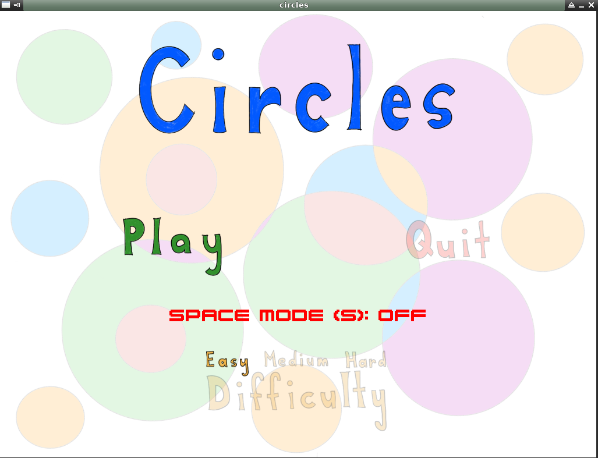
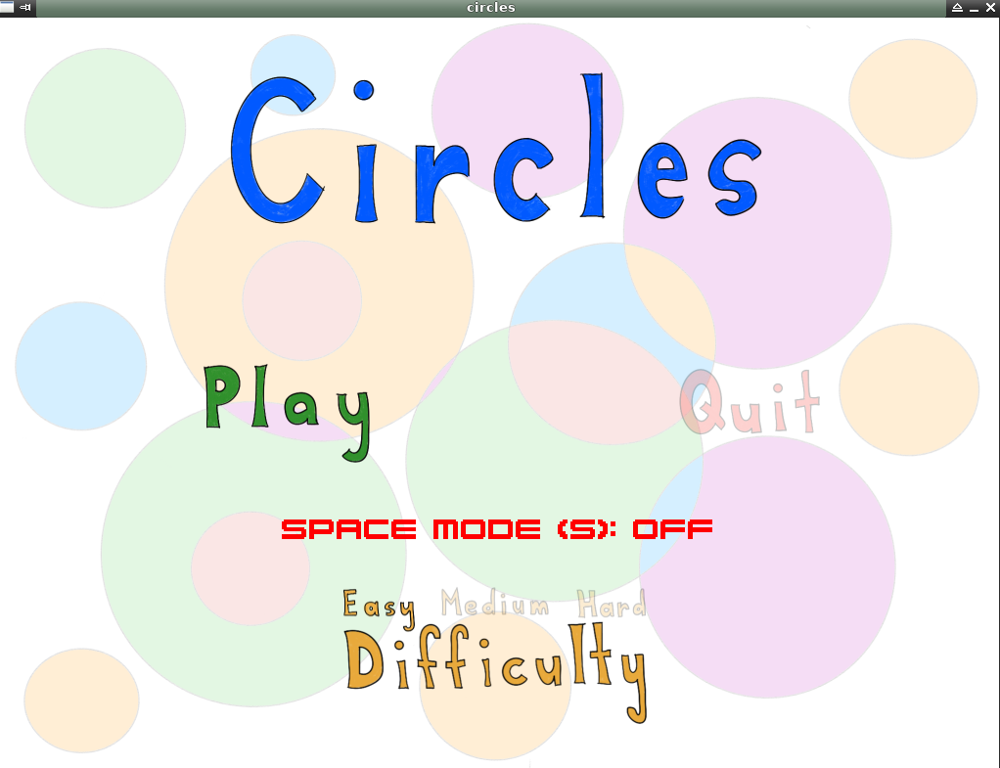
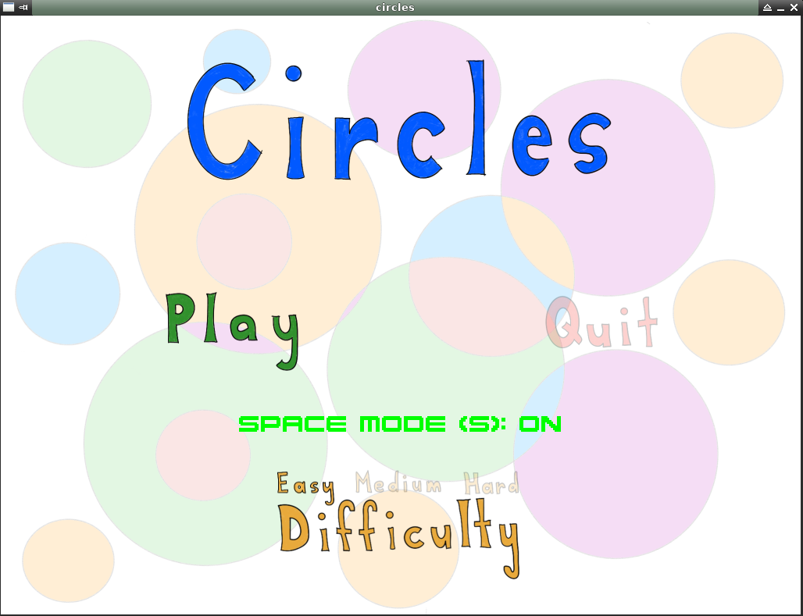
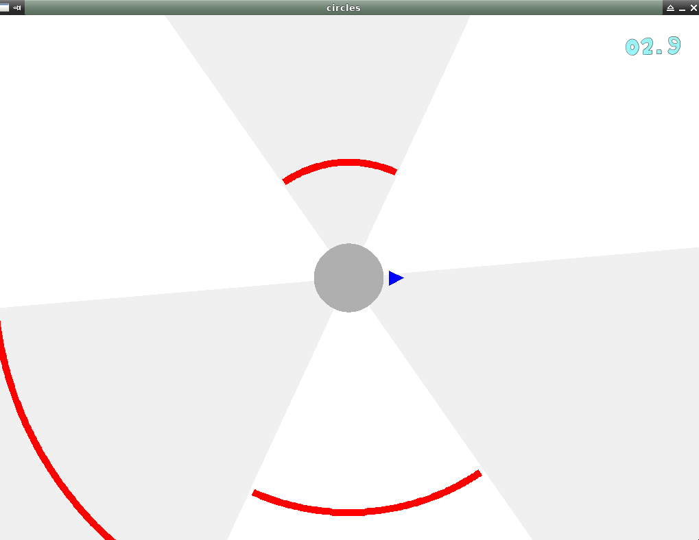
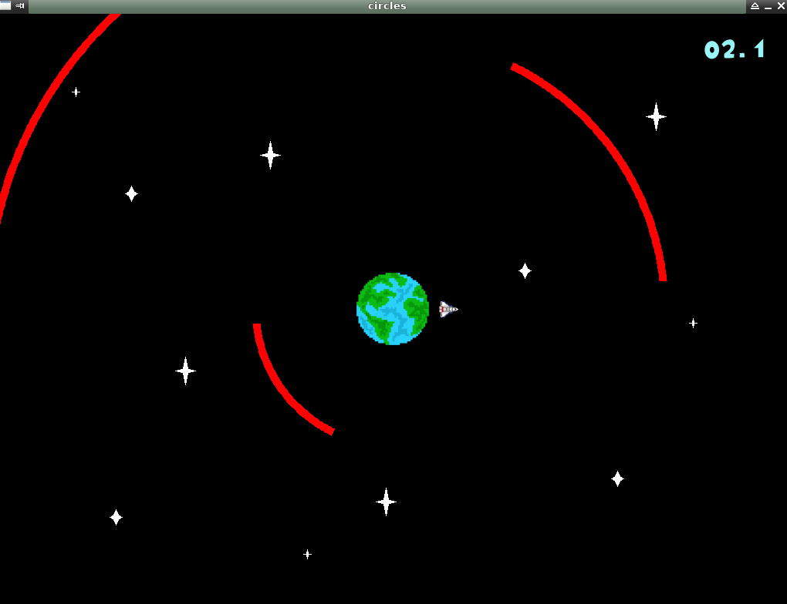
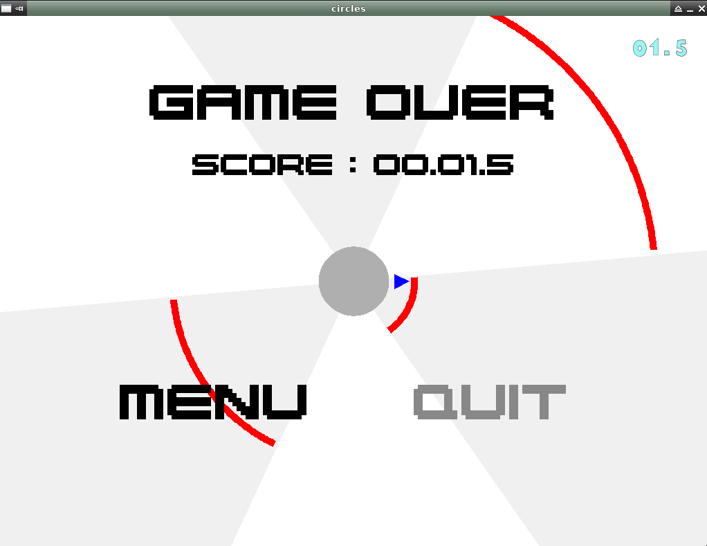

# Travail pratique 3 : Le jeu *Circles*

## Description

* Circles est un petit jeu vidéo inspiré du jeu Super Hexagon de Terry Cavanagh
* UQAM - INF3135 - automne 2024 

## Auteurs

- Louis-Olivier Beaulieu (BEAL65070403)

## Dépendances

- SDL2 : https://wiki.libsdl.org/SDL2/Installation
- SDL_Image : https://wiki.libsdl.org/SDL2_image/FrontPage
- SDL_GFX : https://www.ferzkopp.net/Software/SDL2_gfx/Docs/html/index.html
- SDL_TTF : https://wiki.libsdl.org/SDL2_ttf/FrontPage
- SDL_Mixer : https://wiki.libsdl.org/SDL2_mixer/FrontPage
- Pandoc : https://pandoc.org/installing.html
- imagemagick : https://imagemagick.org/script/download.php

## Fonctionnement

* Circles peut être compilé en utilisant la command `make` a la racine du projet.

ex:
```sh
 $ make
```
* L'executable `circles` sera créé à la racine du projet. celui-ci peut être exécuté avec `./circles`.
  
ex:

```sh
 $ ./circles
```
* Il est aussi possible de comipler et lance le jeu avec la commande `make run`.

ex:
```sh
 $ make run
```
* Le but du jeu est de survivre le plus longtemps possible en déplacant le triangle au centre de l'écran pour éviter les arc de cercles rouge.
* Le score maximum est de 99:59:0 (99 minutes et 59 secondes de survie), mais le jeu ne se termine uniquement lorsque le joueur touche un obstacle.

### Dans le menu

* Pour naviguer entre "Play" et "Quit" dans le menu, utiliser les flèches de gauche et de droite.




* Pour choisir la difficulté, appuyer sur la flèche du haut ou du bas pour activer la sélection de la difficulté, puis utiliser les flèches de gauche ou de droite pour naviguer celles-ci.



* Les touches "e", "m" ou "h" peuvent aussi être utilisés pour choisir respectivement la difficulté "easy", "medium" ou "hard".
* Pour revenir à la navigation entre "Play" et "Quit", la flèche du au ou du bas doit être appuyé.
* La touche "enter" permet de confirmer le choix entre "Play" et "Quit", peut importe le mode de navigation courante du menu.
* Le "space mode" peut être activé et désactivé dans le menu avec la touche "s".



### En jeu

* Le joueur (triangle au centre de l'écran) peut être déplacé dans le sens horaire avec la flèche de droite, et dans le sens antihoraire avec la flèche de gauche afin d'éviter les obstacles.







### En fin de partie

* Pour naviguer entre "Menu" et "Quit" en fin de partie, utiliser les flèches de gauche et de droite.
* La touche "enter" permet de confirmer le choix entre "Menu" et "Quit".




## Plateformes supportées

L'application est supporté (créée et testée) sur Ubuntu 22.04.5

## Références

* Musique du jeu : Circles Revisited - Adam F
* Musique de fin de partie : Safe in Your Skin - Title fight
* Musique du menu : Courtesy - Chipzel

## Division des tâches

Donnez ici une liste des tâches de chacun des membres de l'équipe. Utilisez la
syntaxe suivante (les crochets vides indiquent que la tâche n'est pas
complétée, les crochets avec un `X` indique que la tâche est complétée):

* [x] Gestion du menu (Louis-Olivier)
* [x] Affichage de la scène (Louis-Olivier)
* [x] Affichage du chronomètre (Louis-Olivier)
* [x] Animation des murs (Louis-Olivier)
* [x] Animation du joueur (Louis-Olivier)
* [x] Détection des collisions (Louis-Olivier)
* [x] Affichage d'une partie terminée (Louis-Olivier)
* [X] Gestion de la musique principale (Louis-Olivier)
* [x] Gestion des sons lorsqu'on navigue dans le menu (Louis-Olivier)
* [x] Gestion de la musique de fin de partie (Louis-Olivier)

## État du projet

Le projet est complété et ne comporte pas de bogues.
